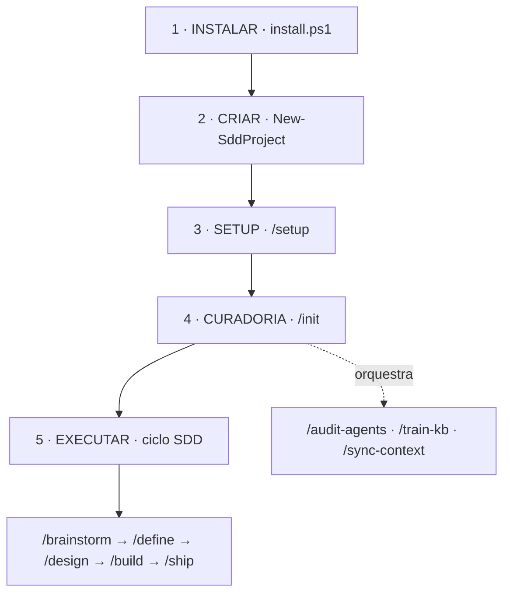

<p align="center">
  
</p>

<h1 align="center">Native-SDD</h1>

<p align="center">
  <a href="docs/VISAO.md">Visão</a> ·
  <a href="docs/USO.md">Uso</a> ·
  <a href="docs/HARNESS-CONTRACT.md">Harness Contract</a>
</p>

<p align="center">
  
  
  
  
  
</p>

---

> Um **scaffold genérico e sem contexto de tarefa** que se **auto-otimiza** na inicialização
> (cura agentes + treina uma KB de domínio) para rodar **Spec-Driven Development (SDD)** com
> velocidade, consistência e qualidade — do **onboarding da máquina** à **execução do projeto**.
>
> *A generic, task-context-free scaffold that self-optimizes on init (curates agents + trains a
> domain KB) to run Spec-Driven Development with speed, consistency and quality.*

---

## ☕ Apoie o projeto / Support this project

Este projeto é mantido de forma **independente** e é **gratuito e aberto**. Se ele te poupou tempo ou
te ajudou a trabalhar melhor, considere apoiar — **qualquer valor** ajuda a manter o desenvolvimento. 🙏

*Maintained independently, free and open. If it saved you time, consider supporting it — any amount helps keep development going.*

**PIX (Brasil)** — chave aleatória / random key:

```
b784c378-b3e4-4617-8dbb-ca6c5b722a8f
```

---

## O que é / What it is

Uma metodologia pessoal — desenhada para ser **clonável por qualquer um** — que reúne quatro coisas
num só lugar:

- **Onboarding automático** — 1 comando prepara a máquina (CLIs, Claude Code, `~/.claude/`).
- **Scaffold SDD** — todo projeto novo nasce com `.claude/` pronto para as 5 fases do SDD.
- **Curadoria / auto-otimização** — o scaffold genérico **se especializa** no projeto: cura os
  agentes certos, treina a KB do domínio e mantém os índices coerentes.
- **Padrões verificáveis** — nada é "pronto" sem lint/testes reais; toda lógica é coberta por
  **Pester** no **CI**.

> **Visão completa** em [`docs/VISAO.md`](docs/VISAO.md) · **Guia de uso ponta a ponta** em
> [`docs/USO.md`](docs/USO.md).

## SDD em 30 segundos / SDD in a nutshell

**Spec-Driven Development (SDD)** é desenvolver guiado por **especificação**: em vez de pular
direto ao código, cada feature maior passa por **5 fases sequenciais**, e cada fase produz um
**artefato** que alimenta a próxima — as decisões ficam explícitas e verificáveis *antes* de
virar código. Tarefas pequenas usam o atalho **Dev Loop** (`/dev`), sem o ciclo completo.

| Fase | Comando | O que significa |
|------|---------|-----------------|
| **0 · Brainstorm** | `/brainstorm` | Explorar a ideia e reduzir incerteza **antes** de fixar requisitos |
| **1 · Define** | `/define` | Capturar **requisitos** e critérios de aceite — o *quê* e quando está "pronto" |
| **2 · Design** | `/design` | Definir **arquitetura** e a spec técnica — o *como* construir |
| **3 · Build** | `/build` | **Implementar** com verificação real (lint/testes) + relatório de build |
| **4 · Ship** | `/ship` | **Encerrar**: arquivar a feature e registrar as lições aprendidas |

> Regra de ouro: **uma fase por vez**, sem pular — cada fase consome o artefato da anterior.

## Início rápido / Quickstart

```powershell
# 1. Preparar a máquina + ~/.claude (CLIs, settings, statusline)
onboarding/install.ps1

# 2. Criar um projeto novo já com o scaffold SDD (atalho global instalado no $PROFILE)
New-SddProject meu-projeto -Open

# 3. Dentro do projeto (no Claude Code): configurar contexto e especializar o scaffold
/setup        # preenche o contexto do projeto (stack, domínio, convenções)
/init         # especializa: cura agentes + treina a KB + sincroniza os índices
```

> Projeto **já existente** (brownfield)? Rode `/adapt` — ele detecta a stack e a higiene
> (testes/CI/docs) e delega ao `/init`.

## Como funciona / Flow



1. **Instalar** — `install.ps1` deixa a máquina pronta (deps + `~/.claude` pessoal).
2. **Criar** — `New-SddProject` copia o scaffold genérico (sem contexto de tarefa).
3. **Setup** — `/setup` captura o contexto do projeto (stack, domínio).
4. **Curadoria** — `/init` orquestra `/audit-agents` + `/train-kb` + `/sync-context` p/ especializar.
5. **Executar** — o ciclo SDD: `/brainstorm` → `/define` → `/design` → `/build` → `/ship`.

O scaffold sai genérico (passo 2) e **se especializa sob demanda** (passo 4): a especialização é
gerada na inicialização, não pré-fabricada. Um hook read-only (`curation-nudge`) avisa, sem nunca
alterar nada, quando a curadoria fica desatualizada.

## Dia a dia / Daily loop

Instalar, criar, `/setup` e `/init` são **uma vez por projeto**. No uso recorrente, **comece sempre
por `/status`** — o painel read-only de início de sessão: mostra **git** (branch, pendências, último
commit), **fase SDD** em andamento, **`inbox/`**, saúde da **memória/KB** e **recomenda o próximo
passo** derivado do estado.

```text
/status   → começa o dia: onde paramos + ▶ próximo passo recomendado
```

Siga a recomendação ou ignore — ela só reflete o estado:

| O `/status` mostrou… | Próximo passo |
|----------------------|---------------|
| Projeto não inicializado | `/setup` → `/init` |
| Curadoria incompleta | comando da etapa (`/init`) |
| Feature SDD aberta | próxima fase (`/define` → `/design` → `/build` → `/ship`) |
| Item novo no `inbox/` | `/brainstorm` (feature) ou `/dev` (tarefa pequena) |
| Curadoria desatualizada (staleness) | o comando do sinal (`/sync-context`, `/reflect`, `/learn`…) |
| Tudo em dia | `/brainstorm` p/ nova feature, ou `/dev` |

> `/status` é **read-only** — nunca altera nada; só lê, apresenta e sugere. Pull on-demand, ao lado do
> `curation-nudge` (que avisa staleness sozinho).

## Modo MAX / Max mode

Para um bloco de trabalho **denso ou autônomo** (refactor amplo, feature inteira, investigação cruzando
muitos arquivos), **`/max`** liga um modo de **operação máxima** — e **`/max off`** desliga. Quando ligado,
o agente:

- **lê todo o contexto** do projeto (KB, memória, skills, MCPs, hooks) — o orçamento de tokens fica em silêncio;
- **recomenda** o modelo maior + mais *pensamento* (effort) para tasks densas — **sem trocar à força** (segue `model: inherit`);
- atua como **orquestrador-mestre / hub**: delega a experts via `/orchestrate` (paralelo, co-dependente ou independente);
- **reduz a fricção** dos prompts de permissão do **não-crítico** (leitura/busca/navegação).

**Sem baixar as defesas — é permissão-só, guardas mantidos.** O MAX **nunca** toca hooks/settings, **nunca**
usa `bypassPermissions` e **nunca** relaxa a verificação de qualidade (lint/testes/gates/fases SDD). Os
guardas (`secret-guard`, `destructive-guard`, managed policy) seguem **ativos** e
interceptam o crítico — a redução de fricção vem do `defaultMode: auto` da sessão, e os hooks sobrepõem a
auto-aprovação. Ao ligar, um **aviso** mostra exatamente o que foi reduzido **e** o que continua protegido;
o estado é **fail-closed** e **não persiste entre sessões**.

| Comando | O que faz |
|---------|-----------|
| `/max` | Liga o modo (sticky) + bootstrap de contexto + **aviso** |
| `/max off` | Desliga e volta ao fluxo normal |
| `/max status` | Mostra o estado atual (ligado desde / validade) |

> *For a dense or autonomous work block, `/max` turns on a **maximum-power** mode — full context,
> recommended bigger model/effort, master-orchestrator — that is **permissions-only**: it never touches
> hooks/settings, never uses `bypassPermissions`, and keeps every security guard and quality gate active.*

### Várias sessões ao mesmo tempo — `/peers`

Quando você roda **mais de uma sessão do Claude Code no mesmo projeto** (duas features em paralelo, dois
chats, dois orquestradores-mestre), elas se enxergam por um **quadro file-based** — sem daemon, sem rede.
É a versão nativa, low-friction, da ideia do `claude-peers-mcp`:

- cada sessão **publica sua presença** automaticamente (id, branch, *summary* derivado do que está fazendo,
  *heartbeat*) via o hook **`peer-heartbeat`** — o *summary* sai de branch + fase SDD + arquivos tocados,
  **sem chamada externa e sem dados pessoais**;
- **`/peers`** mostra **quem mais está ativo** (e em que área), entrega **recados assíncronos** entre
  sessões (`/peers msg <id> "não mexa em auth/"`) e deixa você ajustar seu *summary* (`/peers summary …`);
- o **`/status`** ganhou uma seção que lista as sessões ativas; sob **`/max`**, o orquestrador-mestre
  **consulta os peers antes de fazer fan-out** — assim dois mestres se coordenam em vez de se atropelar.

O quadro vive em `.claude/.cache/peers/` (efêmero, **fora do git**); peers inativos somem sozinhos (TTL).

> *Running more than one Claude Code session in the same project? A **file-based board** (no daemon, no
> network) lets them see each other: each session auto-publishes presence (branch + derived summary +
> heartbeat) via the `peer-heartbeat` hook, and **`/peers`** lists who's active, delivers async messages
> between sessions, and surfaces in `/status` and `/max` (the master-orchestrator checks peers before
> fanning out). The board is ephemeral, under `.claude/.cache/peers/`, never committed.*

## O que tem dentro / What's Inside

```
.
├── onboarding/     Instalador automático e criação de projetos (Windows · Linux)
│   ├── install.ps1         entrypoint Windows: prepara a máquina + ~/.claude (CLIs, settings, statusline)
│   ├── install.sh          entrypoint Linux/macOS (POSIX): detecta o SO e delega
│   ├── new-project.ps1     cria/atualiza um projeto com o scaffold (New-SddProject / nsp)
│   ├── windows/            impl. real: apply, install-clis, install-mcp (context7), install-plugins (suplementos opt-in, -Themes), install-local-ai (MCP local via Ollama, opt-in), lib.ps1 (puras)
│   ├── local-ai/           server MCP versionado (modelo local via Ollama) + bench + installer .sh (macOS/Linux) — opt-in via install.ps1 -WithLocalAi
│   ├── linux/              impl. real: apply.sh + install-clis.sh (apt/dnf/pacman; instala pwsh + Claude Code)
│   ├── macos/              stub consciente (apply.sh) — em breve
│   └── tests/              Pester (smoke de segurança) + e2e-linux.sh (validação CI nas 3 distros)
├── templates/      Artefatos prontos, copiados pelo instalador
│   ├── project-scaffold/   o .claude/ por projeto (rules, commands, agents, KB, hooks) + docs/ + inbox/ + .githooks/ (pre-commit anti-segredo) + AGENTS/CLAUDE
│   ├── global-claude/      config pessoal de nível usuário (~/.claude: CLAUDE.md, settings, statusline, hooks: secret-guard + destructive-guard)
│   └── managed-policy/     managed policy opt-in (deny inviolável: scrub de segredos + git/destrutivo catastrófico) — parceira do modo auto
├── tools/          Validadores PowerShell (funções puras) + suíte Pester
│   ├── check                                 runner único: lints + Pester (o CI chama este)
│   ├── agent-lint · kb-lint · config-lint · command-lint    contratos de agente / KB / settings / commands
│   ├── command-table-lint · resync-lint · hooks-lint · pii-lint · rules-budget   tabela de comandos / resync / hooks / PII / orçamento de contexto
│   ├── init · audit-agents(*) · sync-context · adapt   curadoria e brownfield
│   ├── update-skills · skill-gap             higiene e geração de skills
│   ├── supplements(.psd1/.ps1)               repertório curado de skills/plugins por tema (opt-in, user-scoped)
│   ├── orchestrate · reflect · telemetry · learn     protocolo do líder · consolidação · telemetria · lições→KB
│   ├── status · max                          painel de início de sessão · modo de operação máxima
│   ├── graph-export · publish · simulate     grafo unificado: graph.json/cypher + view HTML (sem servidor) · distribuição (espelho público) · simulador de stack
│   └── tests/                                Pester de cada ferramenta
├── methodology/    A metodologia escrita: 01-onboarding · 02-execution · 03-standards
├── features/       Backlog priorizado (BACKLOG.md) + gate de validação (VALIDACAO.md)
├── docs/           Visão, guia de uso e decisões de projeto
└── .claude/        Artefatos SDD deste próprio repo (features, reports, archive)
```

> **Repo de desenvolvimento × template distribuído.** A árvore acima é a do repositório **canônico**.
> O **template** que você recebe ("Use this template") traz só a **superfície de produto** —
> `onboarding/`, `templates/`, `methodology/`, `tools/` (runtime) e `docs/` de produto. As pastas e
> arquivos de **desenvolvimento** — `features/`, `.claude/` (raiz), `tools/tests/`, `tools/publish.ps1`
> e `onboarding/tests/` — **não** vêm na cópia.

> `(*)` a lógica de `/audit-agents` vive no command + `agent-lint`; nem todo command tem um `.ps1`
> dedicado — muitos são **auto-contidos**.

## Conceitos-chave / Key Concepts

O coração do framework é o `.claude/` que cada projeto recebe:

| Peça | O que é | Onde |
|------|---------|------|
| **Commands** | Slash commands auto-contidos — uma fase/ação por comando | `.claude/commands/` |
| **Rules** | Contexto **sempre ativo** (workflow SDD, CLI-first, docs-first, taxonomia da KB, orquestração) | `.claude/rules/` |
| **Agents** | **9 experts de papel** universais (ver [Agentes](#agentes--agents)); os de **domínio** surgem na curadoria | `.claude/agents/` |
| **KB** | Base de conhecimento em **4 camadas** (`business` / `tools` / `implementation` / `operations`), começa vazia | `.claude/kb/` |
| **Docs** | Documentação humano×LLM **fora da KB** (doc de código/ADR, runbook, registros); produzida pelo `documenter` / `/document` | `docs/` |
| **Hooks** | `curation-nudge` (staleness, read-only) + guards de segurança (`secret-guard`, `destructive-guard`) | `.claude/hooks/` |
| **AGENTS.md** | Contrato **canônico** para qualquer agente (Claude/Codex/…); `CLAUDE.md` aponta para ele | raiz do projeto |

### As 4 camadas da KB

| Camada | Pergunta que responde |
|--------|------------------------|
| `business/` | Qual é a regra de negócio / métrica? |
| `tools/` | Como funciona esta tecnologia em geral? *(camada que puxa doc atual via context7)* |
| `implementation/` | O que **nós** construímos/configuramos? |
| `operations/` | Como rodo, reinicio ou recupero? |

## Agentes / Agents

O scaffold traz **9 subagents de papel/disciplina** — **universais** (agnósticos de stack), não de
tecnologia. Cada um tem um escopo distinto e é invocado pela ferramenta `Agent` (sozinho ou em cadeia)
quando a tarefa se beneficia de **contexto próprio**.

| Subagent | `role` | Para quê |
|----------|--------|----------|
| `explorer` | search | Localizar código / entender arquitetura antes de implementar |
| `code-reviewer` | review | Revisão **ampla** de diff/PR (bugs, segurança, aderência, simplicidade) |
| `test-writer` | testing | Escrever/completar testes cobrindo os Acceptance Tests |
| `git-workflow` | vcs | Higiene de repo: conventional commits, branches, PRs, `.gitignore` |
| `security-reviewer` | security | **Profundidade** em segurança: segredos, injeção, authn/authz, deps |
| `debugger` | debug | A partir de falha/stacktrace: isolar **causa-raiz** e propor o fix mínimo |
| `validator` | validation | Verificar **conformidade do resultado** à spec/AT (roda e observa) |
| `documenter` | documentation | Documentar/registrar em `docs/` (humano×LLM, **fora da KB**), nunca-destrutivo |
| `external-observer` | observation | Observar um **alvo externo/opaco** (site/API/app rodando) e confrontá-lo com referência (validar) ou inferir sua lógica (mapear) — read-only, nunca clona |

**Como se conectam.** Cada agente declara `role` (enum fechado) e `connects_to` no frontmatter — um
**grafo** de quem costuma encadear com quem (ex.: `debugger → test-writer`), materializado em
[`agents/AGENT_MAP.md`](templates/project-scaffold/.claude/agents/AGENT_MAP.md). O líder escolhe o expert
(ou a cadeia) pelo **tipo de tarefa**, conforme a **§Seleção de executor** de
[`agent-routing.md`](templates/project-scaffold/.claude/rules/agent-routing.md).

**Modelo.** Todos usam `model: inherit` — rodam no modelo da **sessão**; escala-se para `opus`
**por-invocação** em tarefa pesada/crítica (sem hardcode).

**Domínio fica fora do base.** Agentes de **stack/domínio** (ex.: `sql-reviewer`, `frontend-specialist`)
**não** vêm no scaffold — são gerados sob demanda pela curadoria (`/audit-agents`) em
`.claude/agents/domain/`, a partir do contexto real do projeto. Assim o base permanece **genérico** e os
9 papéis universais valem para qualquer projeto.

## Comandos / Commands

Todos auto-contidos, em `.claude/commands/`. Detalhe de roteamento em `.claude/rules/agent-routing.md`.

| Comando | Papel |
|---------|-------|
| `/setup` | Preenche o contexto do projeto (`project-context.md`) |
| `/init` | **Especializa o scaffold**: orquestra `/audit-agents` → `/train-kb` → `/sync-context` com aprovação por etapa |
| `/adapt` | Adota projeto **existente** (brownfield): detecta stack + higiene e delega ao `/init` |
| `/audit-agents` | Cura agentes de domínio nas lacunas do projeto |
| `/train-kb` | Povoa a KB por **ondas** (camada `tools/` puxa doc atual via context7) |
| `/sync-context` | Regenera índices/ponteiros (`AGENT_MAP`, `kb/_index.yaml`) com o estado curado |
| `/update-skills` | Inventaria e atualiza skills (global + projeto), preservando as custom |
| `/skill-gap` | Detecta brecha de skill nas ondas da KB e gera o esqueleto faltante |
| `/supplements` | **Repertório curado** de skills/plugins por disciplina (design · reporting · data · security · dev · ai · meta): lista por tema e instala (opt-in, user-scoped) |
| `/brainstorm` → `/define` → `/design` → `/build` → `/ship` | As **5 fases** do SDD |
| `/dev` | Dev Loop — tarefa pequena, sem o ciclo completo |
| `/review` | Revisa PR ou diff |
| `/doubt` | Dúvida adversarial *in-flight* antes de firmar uma decisão (revisor fresh-context, devolve dúvidas) |
| `/orchestrate` | Protocolo líder→subagentes p/ um objetivo/plano aprovado (gate por task) |
| `/iterate` | **Laço bounded "até o verde"**: martela uma meta verificável (lint/suíte/type-fix) em sandbox (`worktree`) com circuit-breakers; merge é humano |
| `/reflect` | Consolida/compacta a KB quando cresce (MERGE/COMPRESS/PRUNE), preservando regras+casos |
| `/learn` | Promove uma **lição recorrente** do acervo de `SHIPPED` a uma entrada de KB `operations` (com proveniência) |
| `/document` | Documenta/registra em `docs/` (humano×LLM, fora da KB), nunca-destrutivo |
| `/simulate` | Simula uma mudança/fix **antes de aplicar** (isolado, nunca-destrutivo): resultado esperado vs baseline |
| `/telemetry` | Painel de iterações por fase do SDD |
| `/status` | **Início de sessão** — painel read-only (git, fase SDD, inbox, memória, staleness) + ▶ próximo passo |
| `/check` | Valida a **conformidade** dos artefatos curados (`.claude/`): KB + agentes + `settings.json`; veredito read-only |
| `/doctor` | **Health-check do runtime** dos guards de segurança — prova que os hooks ainda disparam (não só a config) |
| `/max` | **Modo de operação máxima** sob demanda: contexto total + potência recomendada + orquestrador-mestre, **permissão-só** (guardas mantidos); `/max off` desliga |
| `/peers` | **Coordenação entre sessões concorrentes** (file-based): lista peers ativos (branch/summary/heartbeat) + caixa de recados assíncrona; `/peers msg <id>` · `/peers summary` |

### Quero… → use

| Quero… | Comando |
|--------|---------|
| Começar o dia / ver onde parei | `/status` |
| Trabalhar no máximo (bloco denso/autônomo) | `/max` … `/max off` |
| Ver quem mais está no projeto (2+ sessões) / coordenar | `/peers` |
| Começar um projeto do zero | `New-SddProject` → `/setup` → `/init` |
| Adotar um repositório que já existe | `/adapt` |
| Tocar uma feature de verdade | `/brainstorm` → … → `/ship` |
| Resolver algo pequeno e direto | `/dev` |
| Re-especializar após mudanças de domínio | `/init` (ou as etapas isoladas) |
| Conferir se os índices batem com o real | `/sync-context` |
| Validar se os artefatos curados estão conformes | `/check` |
| Instalar um suplemento (skill/plugin) por disciplina | `/supplements <tema>` (ou `install.ps1 -ExtraPlugins -Themes <tema>`) |

## Princípios / Philosophy

1. **Genérico e context-free.** O scaffold não carrega contexto de tarefa — é base limpa que **se
   especializa** quando inicializado.
2. **Auto-otimização na inicialização.** A curadoria ajusta agentes, treina a KB e sincroniza o
   contexto. Especialização sob demanda, não pré-fabricada.
3. **SDD como espinha de execução.** Features grandes passam pelas 5 fases; tarefas pequenas usam o
   Dev Loop.
4. **Claude-first, portável.** Otimizado para Claude Code (commands, hooks, MCP), com artefatos (SDD,
   KB, regras, `AGENTS.md`) estruturados para portar a outras ferramentas.
5. **Qualidade verificável.** Nada é "pronto" sem verificação real (lint, testes, critérios de
   aceite). Não inventar dados; não versionar segredos.
6. **Segurança em camadas, sem barrar.** A rede é **hook-based**, não prompt-based: git **pre-commit**
   (bloqueia o commit), hook **secret-guard** (confirma em commit/push e na leitura de `.env`),
   **destructive-guard** (confirma `rm -rf` / git destrutivo) e **managed policy** (deny inviolável:
   segredos + git/destrutivo catastrófico). Por isso o `defaultMode: auto` reduz os prompts **sem**
   desligar a proteção — os hooks sobrepõem a auto-aprovação. *Educar, não barrar*: prioriza o risco
   irreversível, deixa o resto fluido para quem é experiente.

## Desenvolvimento / Development

Antes de abrir um PR, rode a **mesma verificação do CI** localmente — um comando agrega o
PSScriptAnalyzer, os lints de conformidade e o Pester:

```powershell
pwsh tools/check.ps1              # tudo (lints + testes)
pwsh tools/check.ps1 -SkipPester  # rápido: só os lints estáticos
```

Após o `install.ps1`, o atalho **`sddcheck`** (registrado no `$PROFILE`) roda o mesmo runner de
qualquer pasta, resolvendo o repo via `$env:SDD_WORKFLOW_HOME` — repassa as flags:

```powershell
sddcheck              # = tools/check.ps1, de qualquer diretório
sddcheck -SkipPester  # idem, só os lints estáticos
```

Verde aqui = verde no CI: o `ci.yml` chama o **mesmo** `tools/check.ps1` (fonte única dos escopos).

> Before opening a PR, run the **same checks as CI** locally: `pwsh tools/check.ps1` aggregates
> PSScriptAnalyzer, the conformance lints and Pester (`-SkipPester` for a fast lints-only pass).
> Green here = green in CI — the workflow calls the same script.

## Requisitos / Requirements

- **Windows e Linux** — implementação real e validada em CI; macOS é stub consciente. O runtime
  do framework é o **PowerShell 7+** em todo SO (instalado pelo próprio onboarding).
- **Claude Code** (CLI/desktop). O onboarding instala as CLIs esperadas (`git`, `gh`, `node`,
  `python`, `uv`, `jq`, `yq`, `ripgrep`): no **Windows** via `install.ps1` (winget); no **Linux**
  via `install.sh` (apt/dnf/pacman).
- **context7 MCP** — opcional e não-bloqueante (melhora a camada `tools/` da KB com doc atual).
- **local-ai MCP** — opcional (`install.ps1 -WithLocalAi`): delega trabalho pesado a um **modelo
  local via Ollama** (offline, sem custo de API). Exige Ollama + `uv`; ver [`onboarding/local-ai/`](onboarding/local-ai/README.md).

## Idioma / Language

Documentação **bilíngue**: estrutura e narrativa em **português**, termos e nomes de artefato em
**inglês** (padrão das ferramentas e eventual compartilhamento público).
