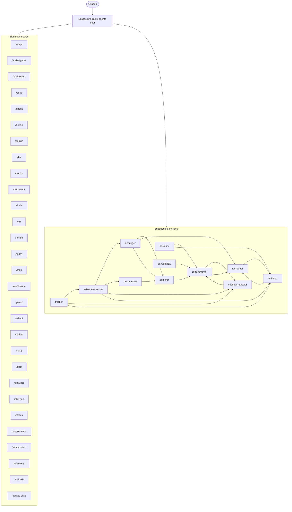

# Mapa de agentes

> ⚠️ **Gerado por /sync-context — não editar à mão.** Rode /sync-context para atualizar.

## Grafo

```mermaid
graph TD
    user([Usuário]) --> lead[Sessão principal / agente líder]

    subgraph CMD["Slash commands"]
        c_adapt["/adapt"]
        c_audit_agents["/audit-agents"]
        c_brainstorm["/brainstorm"]
        c_build["/build"]
        c_check["/check"]
        c_define["/define"]
        c_design["/design"]
        c_dev["/dev"]
        c_doctor["/doctor"]
        c_document["/document"]
        c_doubt["/doubt"]
        c_init["/init"]
        c_iterate["/iterate"]
        c_learn["/learn"]
        c_max["/max"]
        c_orchestrate["/orchestrate"]
        c_peers["/peers"]
        c_reflect["/reflect"]
        c_review["/review"]
        c_setup["/setup"]
        c_ship["/ship"]
        c_simulate["/simulate"]
        c_skill_gap["/skill-gap"]
        c_status["/status"]
        c_supplements["/supplements"]
        c_sync_context["/sync-context"]
        c_telemetry["/telemetry"]
        c_train_kb["/train-kb"]
        c_update_skills["/update-skills"]
    end

    subgraph CORE["Subagents genéricos"]
        a_code_reviewer["code-reviewer"]
        a_debugger["debugger"]
        a_designer["designer"]
        a_documenter["documenter"]
        a_explorer["explorer"]
        a_external_observer["external-observer"]
        a_git_workflow["git-workflow"]
        a_security_reviewer["security-reviewer"]
        a_test_writer["test-writer"]
        a_tracker["tracker"]
        a_validator["validator"]
    end

    %% Agentes de domínio: nenhum (surgem via /audit-agents)

    lead --> CMD
    lead --> CORE

    %% Relações connects_to (peer)
    a_code_reviewer --> a_security_reviewer
    a_code_reviewer --> a_test_writer
    a_debugger --> a_explorer
    a_debugger --> a_test_writer
    a_designer --> a_code_reviewer
    a_designer --> a_validator
    a_documenter --> a_explorer
    a_explorer --> a_code_reviewer
    a_explorer --> a_debugger
    a_external_observer --> a_debugger
    a_external_observer --> a_documenter
    a_external_observer --> a_security_reviewer
    a_external_observer --> a_validator
    a_git_workflow --> a_code_reviewer
    a_security_reviewer --> a_code_reviewer
    a_test_writer --> a_validator
    a_tracker --> a_external_observer
    a_tracker --> a_security_reviewer
    a_tracker --> a_validator
    a_validator --> a_test_writer
```
