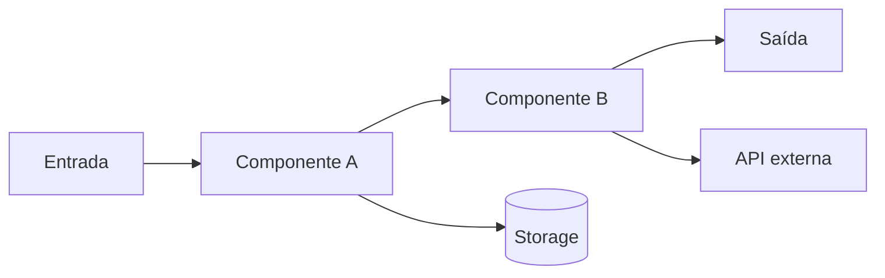

# DESIGN: {Nome da Feature}

> Design técnico para implementar {Nome da Feature}.

## Metadados

| Atributo | Valor |
|----------|-------|
| **Feature** | <FEATURE> |
| **Data** | {AAAA-MM-DD} |
| **DEFINE** | [DEFINE_<FEATURE>.md](./DEFINE_<FEATURE>.md) |
| **Status** | Rascunho / Pronto para Build |

---

## Visão de arquitetura

> Use **Mermaid** (renderiza no GitHub) **e/ou** o **diagrama ASCII** — os dois juntos ou só o
> Mermaid. Mermaid é preferível quando um HTML (visual-explainer) seria **demais** para um
> diagrama inline; o ASCII serve à leitura no terminal. Deixe só o que clarifica; apague o resto.



```text
┌────────────────────────────────────────────────┐
│  {diagrama ASCII: componentes e fluxo de dados} │
│  [Entrada] → [Componente A] → [Componente B] → [Saída]
│                   ↓                ↓            │
│              [Storage]       [API externa]      │
└────────────────────────────────────────────────┘
```

## Componentes

| Componente | Responsabilidade | Tecnologia |
|------------|------------------|------------|
| {A} | {o que faz} | {stack} |
| {B} | {…} | {…} |

## Data Flow
{passo a passo de como os dados percorrem o sistema}

## Integration Points
{APIs, serviços, bancos, filas — contratos de entrada/saída}

## Testing Strategy
{quais testes provam cada Acceptance Test do DEFINE: unit, integração, e2e}

## Error Handling
{falhas esperadas, retries, fallback, mensagens}

## Security
{validação de input, segredos, autenticação/autorização, dados sensíveis}

## Observability
{logs, métricas, traços — o que medir e como verificar em produção}

## Conhecimento da KB consultado

> Entradas da KB curada que **ancoraram** este design (passo *Aterrar na KB* do `/design`). Liste o `id`
> real de cada entrada usada — é o rastro de que o plano se apoia no conhecimento do projeto, não em
> improviso. Se a KB ainda **não** foi treinada (`/train-kb`), deixe a nota de degradação.

| Entrada (`id`) | Camada | Por que ancora este design |
|----------------|--------|----------------------------|
| {ex.: `orders-schema`} | implementation | {ex.: contrato/IDs reais que o componente A consome} |
| {ex.: `deploy-runbook`} | operations | {ex.: passos de recuperação que o Error Handling reusa} |

> _KB não treinada (rode `/train-kb`) — design não ancorado em conhecimento curado._ ← use **esta linha**
> no lugar da tabela quando a pré-condição não vale.

## Localização e infra
- **Onde o código mora:** {caminho}
- **Mudanças de infra/IaC:** {recursos novos/alterados ou N/A}

---

**Próximo passo:** `/build .claude/sdd/features/DESIGN_<FEATURE>.md`
